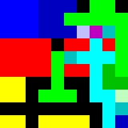

## Some common tools to lookout for
- [dCode](https://www.dcode.fr/)
- [Cryptii](https://cryptii.com/)
- [Esolangs](https://esolangs.org/wiki/Main_Page)
- [Boxentriq](https://www.boxentriq.com/code-breaking)
- [CyberChef](https://gchq.github.io/CyberChef/)
- [Try It Online](https://tio.run/)

### Reversed Text
Sometimes a ***ciphertext*** is just as easy as reversed text. Don't forgot to check under this rock!<br><br>
You can reverse a string using a simple Bash script:
```bash
echo string | rev
```
Or using Python:
```python
ct = "string"
print(ct[::-1])
```

Certainly, let's dive into ASCII encoding and how it's used to represent characters in computers.

### ASCII Encoding:

ASCII (American Standard Code for Information Interchange) is a character encoding that assigns numerical values to characters. It was one of the earliest character encoding standards and is widely used to represent characters in computers and communication systems.

Each character is assigned a unique numerical value (code point) that corresponds to its representation. For example, the character 'A' is assigned the code point 65, 'B' is assigned 66, and so on.
Refer [Ascii encoding](https://www.cs.cmu.edu/~pattis/15-1XX/common/handouts/ascii.html)

#### Example:

Let's consider the string "Hello, World!" and encode it using ASCII.

**String:** "Hello, World!"

#### ASCII Encoding Process:

1. Each character in the string is assigned its ASCII code.
2. The ASCII codes are represented as decimal numbers.

#### ASCII Encoding "Hello, World!":

- **Character 'H':** ASCII Code 72
- **Character 'e':** ASCII Code 101
- **Character 'l':** ASCII Code 108 (appears twice)
- **Character 'o':** ASCII Code 111
- **Character ',':** ASCII Code 44
- **Character ' ':** ASCII Code 32
- **Character 'W':** ASCII Code 87
- **Character 'r':** ASCII Code 114
- **Character 'l':** ASCII Code 108 (appears twice)
- **Character 'd':** ASCII Code 100
- **Character '!':** ASCII Code 33

#### Encoded ASCII Representation:

The encoded ASCII representation of the string "Hello, World!" is a sequence of decimal numbers:

```
72 101 108 108 111 44 32 87 111 114 108 100 33
```

#### Usage and Purpose:

- ASCII encoding is used in text files, communication protocols, and programming languages to represent characters.
- It's the basis for various other character encodings like UTF-8, UTF-16, etc.
- ASCII-encoded characters are used as indices in fonts and character sets for rendering text.

ASCII encoding is a foundational concept in computer systems and is responsible for how characters are represented and processed electronically.

### HexString

Converting a string into its hexadecimal representation involves representing each character in the string as a pair of hexadecimal digits. Hexadecimal (hex) is a base-16 numbering system, using digits 0-9 and letters A-F to represent values from 0 to 15. This conversion is often used to represent binary data in a more human-readable form.

Here's a description of converting a string into hexadecimal with an example:

#### Example:

**String:** "Hello, World!"

#### Conversion Process:

1. **ASCII Representation:** Each character in the string is represented by its ASCII code, which is a numerical value assigned to each character. 

2. **Hexadecimal Conversion:** Convert the ASCII code of each character into its hexadecimal representation.

#### Converting "Hello, World!":

1. **String:** "Hello, World!"
2. **ASCII Codes:** (72, 101, 108, 108, 111, 44, 32, 87, 111, 114, 108, 100, 33)
3. **Hexadecimal Conversion:** (48, 65, 6C, 6C, 6F, 2C, 20, 57, 6F, 72, 6C, 64, 21)

#### Hexadecimal Representation:

The hexadecimal representation of the string "Hello, World!" is "48656C6C6F2C20576F726C6421".

#### Usage and Purpose:

Converting strings to hexadecimal is commonly used in various applications, including:

- Representing binary data in a more compact and readable form.
- Encoding data for use in URLs or as identifiers.
- Storing cryptographic keys and hashes.

In the example above, each character's ASCII code is converted to its hexadecimal representation. This process is often used to work with binary data in a way that's easier to display and manipulate compared to raw binary values.

### Base64
Base64 is a group of similar binary-to-text encoding schemes that represent binary data in an ASCII string format by translating it into a radix-64 representation. The term Base64 originates from a specific MIME content transfer encoding.<br><br>
It's primarily used for situations where binary data needs to be transmitted or stored as text, such as in email attachments, URLs, or configuration files. Base64 is not an encryption method; rather, it's a way to represent binary data in a format that is safe for text-based systems.

Here's a detailed explanation of Base64:

#### Basics of Encoding:

1. **Character Set:** Base64 uses a set of 64 different characters (hence the name). These characters consist of letters (uppercase and lowercase), digits, and two additional symbols.

2. **3 Bytes Mapping:** Base64 encodes binary data in groups of 3 bytes (24 bits) at a time. Each group of 3 bytes is then split into four 6-bit chunks.

3. **Encoding Table:** Base64 uses an encoding table that assigns each possible 6-bit value to a specific character. The table is the foundation for the conversion from binary to text.

#### Encoding Process:

1. **Binary Data:** The input binary data is divided into groups of 3 bytes (24 bits).

2. **Dividing into 6-Bit Chunks:** Each 3-byte group is divided into four 6-bit chunks. If the binary data length is not a multiple of 3, padding is added to make it a multiple of 3 bytes.

3. **Mapping to Characters:** Each 6-bit chunk is mapped to its corresponding character in the Base64 encoding table.

4. **Padding:** If the input data is not a multiple of 3 bytes, padding is added to the end of the encoded data to ensure that the last chunk is properly formed.

#### Example:

Let's encode the ASCII string "Hello" using Base64:

1. **String:** "Hello"
2. **ASCII Values:** 72 101 108 108 111
3. **Binary:** 01001000 01100101 01101100 01101100 01101111

Divide the binary data into 6-bit chunks:

- 010010 000110 010101 101100 110011 011011 000110 110011 011011 011110
- Decimal: 18 6 21 44 51 27 6 51 27 30

Map the decimal values to Base64 characters:

- 18: S
- 6: G
- 21: V
- 44: s
- 51: z
- 27: H
- 6: G
- 51: z
- 27: H
- 30: e

Encoded Base64: "SGVsbG8="

#### Decoding:

Decoding Base64 is the reverse process. Each character is mapped back to its 6-bit value, and then these values are combined to retrieve the original binary data.

#### Key Points:

- Base64 doesn't provide encryption; it's meant for data representation.
- Base64 encoding increases the size of data by about 33%.
- URLs often use Base64 encoding to safely include binary data.
- Base64 is commonly used in email systems for attaching images and files.

In summary, Base64 is a mechanism to represent binary data using a limited set of characters, making it suitable for text-based environments. It's essential when binary data needs to be included in systems that only support text.

### Brainfuck


Here are the eight Brainfuck commands:

| Command | Description                                          |
|---------|------------------------------------------------------|
| `>`     | Increment the memory pointer (move to the right)   |
| `<`     | Decrement the memory pointer (move to the left)    |
| `+`     | Increment the value at the current memory cell     |
| `-`     | Decrement the value at the current memory cell     |
| `[`     | Jump forward to the command after matching `]` if the value at the current cell is zero |
| `]`     | Jump back to the command after matching `[` if the value at the current cell is nonzero |
| `,`     | Read a single character from input and store it in the current memory cell |
| `.`     | Output the character at the current memory cell    |

Each command operates on a simple memory model, and Brainfuck programs are composed of sequences of these commands to perform computations and execute algorithms.

https://tio.run/#brainfuck

### Atbash Cipher
The Atbash cipher is a substitution cipher with a specific key where the letters of the alphabet are reversed i.e. all A's are replaced with Z's, all B's are replaced with Y's, and so on. It was originally used for the Hebrew alphabet, but can be used for any alphabet system.<br><br>
You can use the following tools to encrypt/decrypt using the Atbash cipher:

- [Cryptii](https://cryptii.com/pipes/atbash-cipher)
- [dCode](https://www.dcode.fr/atbash-cipher)

Here's an example of how the Atbash cipher works:

Example:
Plaintext: HELLO WORLD
Atbash Encrypted: SVOOL DLIOW

#### How Atbash Works:
Alphabet Reversal: In the Atbash cipher, each letter is replaced with its mirror image in the alphabet. The first letter becomes the last, the second becomes the second-to-last, and so on.

Case Insensitivity: The Atbash cipher is case-insensitive, meaning that uppercase letters are converted to lowercase and vice versa.

Non-Alphabetic Characters: Non-alphabetic characters, like spaces and punctuation, are not modified and are kept as they are.

#### Encrypting "HELLO WORLD":
Here's how we would apply the Atbash cipher to the plaintext "HELLO WORLD":

H becomes S (reversal of the first letter)
E becomes V (reversal of the fifth letter)
L becomes O (reversal of the twelfth letter)
L becomes O (reversal of the twelfth letter)
O becomes L (reversal of the fifteenth letter)
The same process is repeated for each letter in the plaintext.

#### Decryption:
Interestingly, the Atbash cipher has the same process for encryption and decryption. Reversing the letters twice returns the original text. For example, applying Atbash twice to "SVOOL DLIOW" would yield "HELLO WORLD".

### Malbolge
An esoteric language that looks a lot like Base85, but isn't.<br><br>
Use these interpreters:

- [Malbolge Tools](http://zb3.me/malbolge-tools/)
- [Malbolge - interpreter online](https://malbolge.doleczek.pl/)

```
(=<`#9]~6ZY32Vx/4Rs+0No-&Jk)"Fh}|Bcy?`=*z]Kw%oG4UUS0/@-ejc(:'8dc
```
Translates to - `Hello World!`

### Rockstar
A language intended to look like a song's lyrics, heavily influenced by the lyrical conventions of 1980s hard rock and power ballads. [GitHub Repository](https://github.com/RockstarLang/rockstar)<br><br>
You can use their official online interpreter - https://codewithrockstar.com/online

### Piet
A programming language in which programs look like abstract paintings. The language is named after Piet Mondrian, who pioneered the field of geometric abstract art.<br><br>

)
Translates to - `Hi`